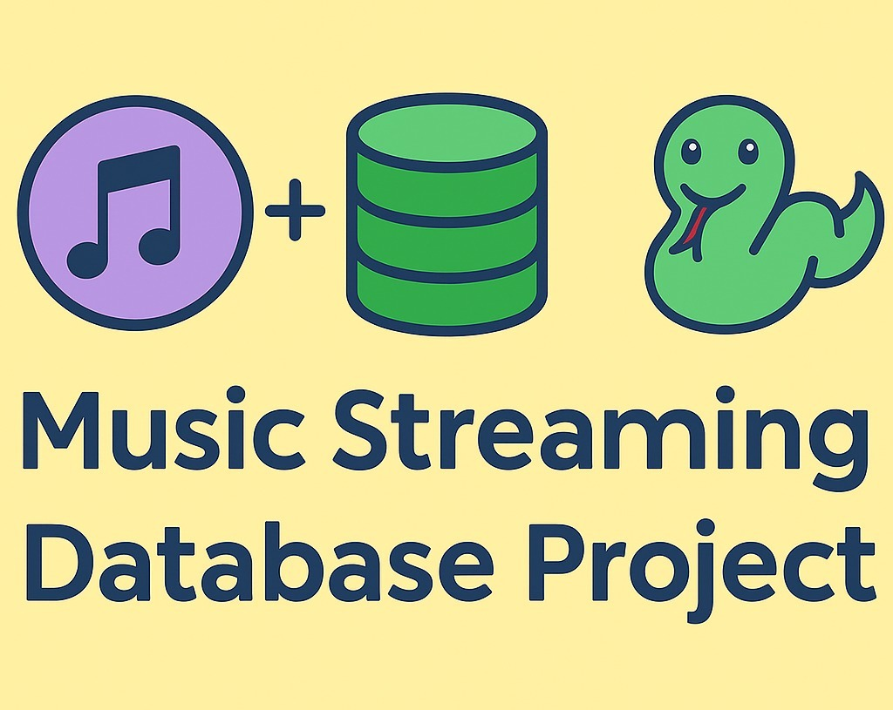

  

# 🎵 Music Streaming Database Project

A fully normalized relational database schema and Python-powered CRUD system designed for a hypothetical music streaming service. This project captures the core backend structure of platforms like Spotify — including users, songs, playlists, artists, and profile images — while ensuring 3NF compliance and robust data integrity.

---

## 📌 What’s Inside

- 🎨 *Entity-Relationship Diagram (ERD)* for visual structure
- 🗄 *SQL Schema* with primary keys, foreign keys, and constraints
- 🐍 *Python CRUD Operations* using pymysql with built-in error handling
- 🔍 *Advanced SQL Queries* to simulate real-world use cases
- ✅ *Test Cases* validating database functionality
- 📄 *Professional Project Summary PDF* with visuals

---

## 💡 Use Case

This project is ideal for:
- Portfolio display
- Practice with SQL normalization & foreign key relationships
- Learning how to integrate Python with SQL for backend development
- Building out a realistic CRUD data app structure
